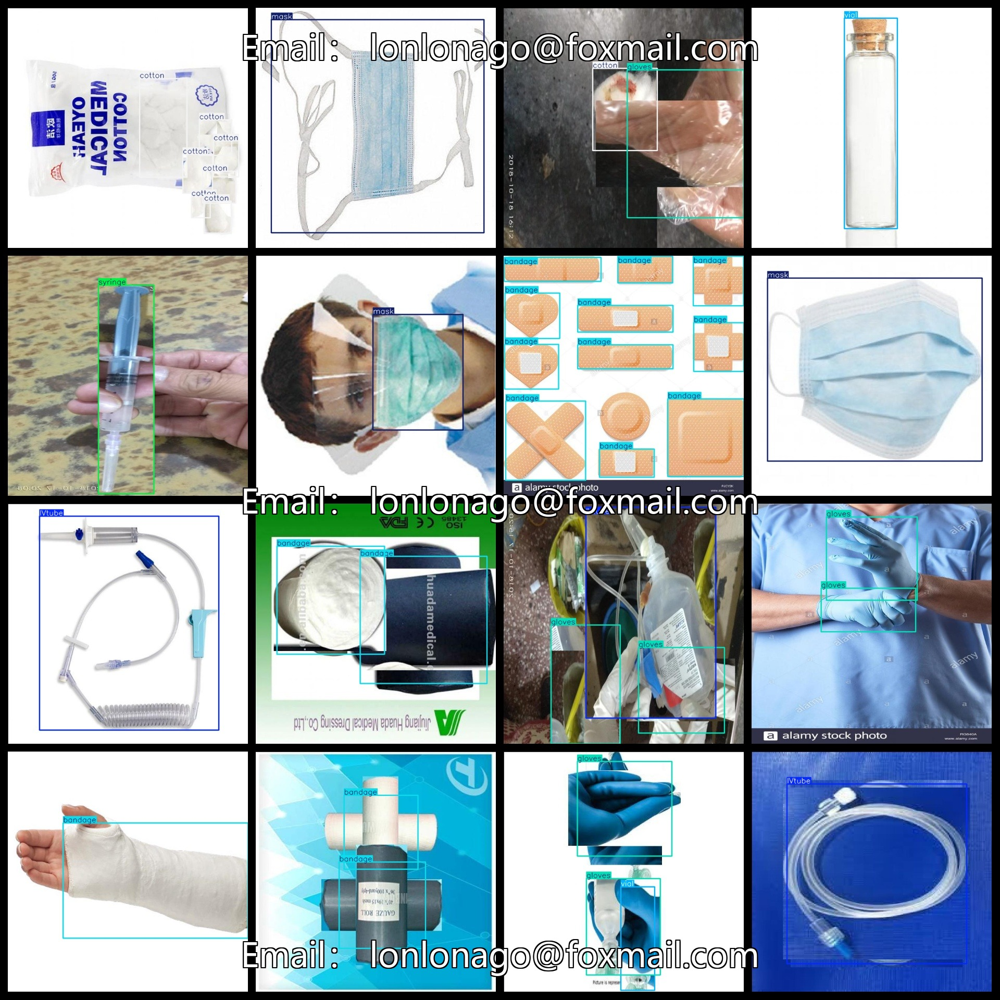

# Medical Disposables Recognition Detection Dataset - 2202 images, YOLO

The Medical Disposables Recognition Detection Dataset consists of 2202 images in the VOC format and YOLO format. The dataset is organized into three folders: JPEGImages, Annotations, and labels.

In the JPEGImages folder, there are a total of 2202 jpg images.

The Annotations folder contains a total of 2202 xml files.

The labels folder has a total of 2202 txt files.

There are a total of 12 categories in the dataset: ["IVtube", "bandage", "cotton", "gloves", "mask", "medical cap", "needle", "scissors", "syringe", "test tube", "vial", "waste"].

["Vascular Catheter", "Gauze", "Cotton", "Gloves", "Mask", "Medical Helmet", "Needle", "Scissors", "Injector", "Test Tube", "Small Bottle", "Waste"]

The number of boxes (note that the order of classes in the YOLO format may not match this, but it is based on the classes.txt file in the labels folder):

IVtube = 354

bandage = 1759

cotton = 1192

gloves = 921

mask = 302

medical cap = 113

needle = 224

scissors = 20

syringe = 237

test tube = 54

vial = 1206

waste = 101

Total number of boxes = 6483

The image resolution is clear (pixel size).

The images have been enhanced.

The shapes of the labels are rectangular boxes, used for object detection recognition.

Important Note: No guarantee is made regarding the accuracy or weights of the trained models using this dataset. This dataset only provides accurate and reasonable annotations.
## Images

---

Here is a pay link on Stripe (https://buy.stripe.com/3cs8yP7sY87d0vu9AB). Please contact me lonlonago@foxmail.com after funding $89, and I will send you a complete data files, thank you!

